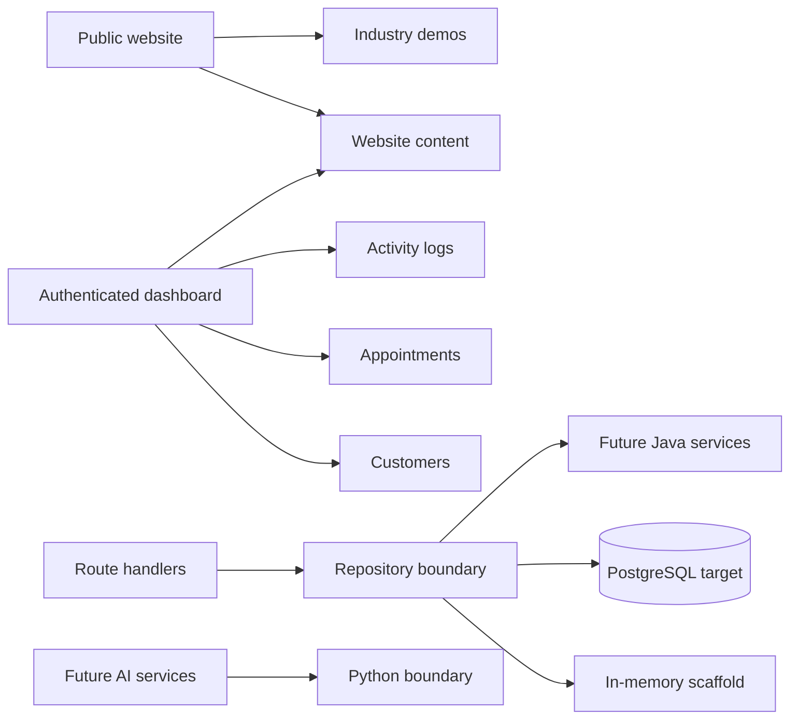

# Platform Architecture

## Current shape

- `src/app/page.tsx` now positions MicroService as a multi-tenant operating system.
- `src/app/auth/*` provides the first sign-in and tenant bootstrap flow.
- `src/app/dashboard/*` exposes customer, appointment, and website content workspaces.
- `src/app/api/*` contains the first thin route handlers for auth and tenant data.
- `src/services/platform/*` owns the repository boundary and workspace seeding.
- `src/types/platform.ts` defines the tenant-scoped domain model.

## Migration goals

- Keep UI components reusable and presentational.
- Move persistence behind a PostgreSQL repository without changing route contracts.
- Split business services into Java Spring Boot when the backend grows.
- Keep AI-specific services separate in Python.
