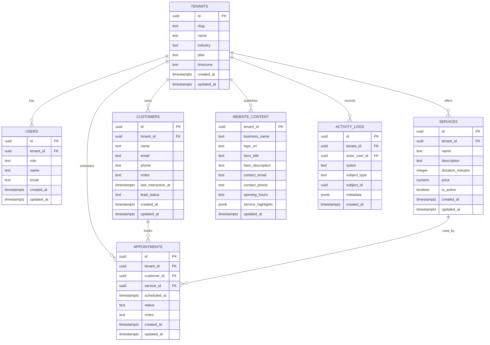

# Database Design

The target schema is relational and tenant-scoped.

## Notes

- Every row should carry `tenant_id` for isolation.
- PostgreSQL is the target store for production.
- The current in-memory repository is only a scaffold for local development.